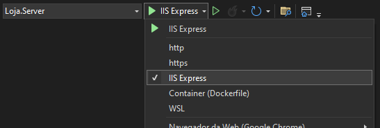

# Resposta ao teste

Projeto desenvolvido como resposta ao teste para vaga Full-stack Developer .NET

## Instruções
- A solução contém diferentes arquivos para execução do projeto. Devido [erro existente na sdk do .NET para configurar SPAs com Docker](https://github.com/dotnet/aspnetcore/issues/41093), é necessário utilizar o ISS Express para teste do frontend. 
- A execução com docker funciona para testes com Swagger.
- Para executar o projeto:
```
    dotnet restore
    dotnet run
```
- Recomenda-se a inicialização através do Visual Studio:



- Novas migrações podem ser adicionadas com `dotnet ef migrations add InitialCreate -s .\Loja.Server\Loja.Server.csproj -c .\Loja.Infra.Data\AppDbContext.cs -o .\Loja.Infra.Data\MigrationsOrderValidator` a partir do diretório do projeto `Loja.Infra.Data`. Estas são aplicadas automaticamente ao executar o projeto.
